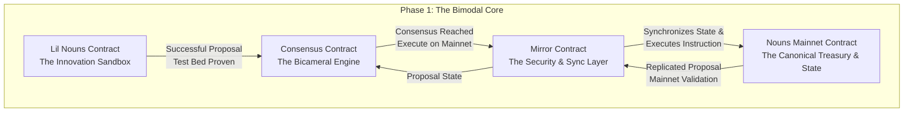

### **The Nouns DAO Evolution: A Phased Roadmap for Resilient Governance & Accelerated Value Creation**

## **A New Paradigm for On-Chain Governance**

Nouns DAO stands at a pivotal moment. To scale its cultural impact and protect its substantial treasury, our governance must evolve from a single point of failure into a resilient, adaptable ecosystem. This roadmap proposes a phased technical architecture designed to achieve precisely that.

Our mission is to build a future where:
*   **Provide an unbreakable foundation on Ethereum.
*   **Enable rapid, safe experimentation in collective decision-making.
*   **De-risks the core treasury while unlocking new vectors for growth.

This is a strategic evolution from a monolithic contract to an **orchestrated ecosystem**, guided by the philosophy: **"Move slowly and secure the assets, so we can move fast and innovate safely."**

### **2. Core Architecture: The Engine for Bimodal Governance**

The core innovation is a multi-contract system that creates a "two-speed" governance model. This separates the high-stakes management of the canonical treasury from the rapid experimentation of community initiatives, all while providing a secure bridge between them.

This document outlines a phased, technical roadmap for the evolution of the Nouns DAO governance model. The proposed architecture is designed to enhance resilience, enable scalable governance experimentation, and formalize a secure upgrade path. The core innovation lies in a multi-contract system that separates concerns, creates a secure testing ground (Lil Nouns), and establishes a robust consensus and state-synchronization layer. This structure mitigates risk while empowering the community to govern more effectively.

The entire process is powered by a hierarchical smart contract system, visualized below:

This architecture is the engine for our phased rollout, designed to deliver immediate value and long-term strategic advantage.

---

### **3. The Phased Roadmap: From Foundation to Flywheel**

#### **Phase 1: The Bimodal Foundation - De-Risking & Parallel Governance (Months 0-6)**

**Business Rationale & Vision:** To protect the core treasury while enabling agile community decision-making. This phase formally separates "day-to-day experimentation" from "canonical treasury actions," de-risking both and establishing a clear path for cross-DAO initiatives.

**Governance Innovation:** Introduces a **bicameral system** where Lil Nouns acts as the "House of Ideas" and Nouns DAO as the "House of Stewardship," with a formal process for collaboration.

**Technical Execution & Deliverables:**

1.  **Nouns Mainnet Contract (The Canonical Layer):**
    *   **Role:** The foundational layer. Holds the definitive treasury and NFT collection.
    *   **Upgrade:** Modified to accept state updates *only* from the authenticated Mirror Contract, making it a **read-only** vault for proposals.

2.  **Mirror Contract (The Security & Synchronization Layer):**
    *   **Role:** The trusted bridge. It continuously clones Nouns DAO activity as a live backup and is the *sole* contract with write-access to the main contract.
    *   **Function:** Accepts instructions from the Consensus Contract (for bi-DAO initiatives) and, with timelocks, directly from Lil Nouns for rapid, low-stakes updates.

3.  **Lil Nouns Mainnet Contract (The Innovation Sandbox):**
    *   **Role:** The rapid prototyping environment. All new governance ideas and partner collaborations start here.
    *   **Modification:** Equipped with logic to forward successful proposals to the Consensus Contract.

4.  **Consensus Contract (The Bicameral Resolution Engine):**
    *   **Role:** The neutral mediator. It formalizes cross-DAO agreement.
    *   **Logic:** A proposal reaches "consensus" when the **same proposal ID has passed successfully in both the Lil Nouns and the Nouns contract (via the Mirror) within a specified time window.** It then commands the Mirror to execute.

**Success Metrics:**
*   All contracts audited and live on Ethereum Mainnet.
*   100% synchronization between Nouns and Mirror contracts.
*   Successful execution of 3+ cross-DAO proposals via the consensus flow.
*   Zero security vulnerabilities in production.

---

#### **The Delegation Engine - Scaling Participation & Reducing Friction (Months 6-10)**

**Business Rationale & Vision:** To increase voter turnout and delegate effectiveness, strengthening governance legitimacy and making the DAO more resilient to attacks. This reduces the operational cost (gas) of participation and professionalizes delegation.

**Governance Innovation:** Shifts from a purely NFT-weighted model to a **professionalized delegation layer**, enabling secure, fluid delegation and gasless voting.

**Technical Execution & Deliverables:**

1.  **Advanced Delegation Vaults:** A smart contract allowing Noun holders to delegate voting power to dedicated delegates *without transferring their NFT*, keeping assets secure in cold storage.
2.  **Gasless Voting Infrastructure:** Full integration of Snapshot or a custom off-chain solution. Delegates vote without gas fees, with results settled on-chain via the Mirror Contract.
3.  **Delegate Toolkit:** Reputation and analytics dashboards to help Noun holders identify effective delegates, creating a market for high-quality governance.

**Key Deliverable:** A significant (>30%) increase in consistent voter participation and a secure framework for professionalized delegation.

---

#### **The Modular Future - Composable Governance & Infinite Scale (Months 10-18+)**

**Business Rationale & Vision:** To position Nouns DAO as the most adaptable governance protocol in Web3, capable of integrating new models without hard forks. This creates immense optionality and future-proofs the ecosystem.

**Governance Innovation:** Moves governance from a static set of rules to a **"Governance App Store,"** where the community can plug-and-play the best new models from across Web3.

**Technical Execution & Deliverables:**

1.  **Governance Module Registry:** A smart contract marketplace for community-built, audited governance modules (e.g., quadratic voting, conviction voting).
2.  **Safe Upgrade Path:** Using the Phase 1 architecture, new modules are tested in the Lil Nouns sandbox and can be promoted to the main Nouns DAO via community consensus.
3.  **Cross-Chain Governance Horizon:** R&D to use the Mirror Contract as a root on Ethereum, with governance actions on cheaper L2s, dramatically reducing costs.

**Key Deliverable:** The first successful deployment of a community-built governance module from Lil Nouns to Nouns DAO, proving infinite adaptability.

# NounsDAOLogicV3 (The Canonical Layer)

Role: The foundational layer. Holds the definitive treasury and NFT collection.

Technical Spec:

Inherits from and mirrors current NounsDAOLogicV2 functionality initially.

Critical Modification: Overrides executeProposal to restrict execution to the NounsStateMirror contract address.

Adds a stateMirror address storage variable with a onlyAdmin setter function, enforced with a 48-hour timelock.

solidity
contract NounsDAOLogicV3 is NounsDAOLogicV2 {
    address public stateMirror;
    
    modifier onlyStateMirror() {
        require(msg.sender == stateMirror, "NounsDAOLogicV3: caller is not the StateMirror");
        _;
    }
    
    function executeProposal(uint256 proposalId) external override onlyStateMirror {
        // ... existing execution logic ...
    }
    
    function setStateMirror(address newStateMirror) external onlyAdmin {
        // ... timelock enforced logic ...
        stateMirror = newStateMirror;
    }
}
#NounsStateMirror (The Security & Synchronization Layer)

Role: The trusted bridge and real-time backup.

Technical Spec:

Tracks the state (proposals, votes, timestamps) of both NounsDAOLogicV3 and LilNounsDAO by processing events.

Maintains a mapping of cross-DAO proposal IDs (bytes32 crossDAOProposalId = keccak256(abi.encode(nounsProposalId, lilNounsProposalId))).

Implements a executeOnNouns function that is callable only by the NounsConsensusEngine.

solidity
contract NounsStateMirror {
    INounsDAOLogicV3 public nounsDAO;
    INounsConsensusEngine public consensusEngine;
    
    mapping(bytes32 => CrossDAOProposal) public crossDAOProposals;
    
    struct CrossDAOProposal {
        uint256 nounsProposalId;
        uint256 lilNounsProposalId;
        bool executed;
    }
    
    function executeOnNouns(
        uint256 nounsProposalId, 
        bytes32 crossDAOProposalId
    ) external onlyConsensusEngine {
        require(!crossDAOProposals[crossDAOProposalId].executed, "Already executed");
        crossDAOProposals[crossDAOProposalId].executed = true;
        nounsDAO.executeProposal(nounsProposalId);
    }
    
    // ... event syncing logic ...
}
# LilNounsDAO (The Innovation Sandbox)

Role: The rapid prototyping environment.

Technical Spec:

A fork of NounsDAOLogicV3 with lower proposal thresholds and shorter voting delays.

Contains a proposeCrossDAO function that forwards a proposal to the NounsConsensusEngine.

solidity
contract LilNounsDAO is NounsDAOLogicV3 {
    INounsConsensusEngine public consensusEngine;
    
    function proposeCrossDAO(
        address[] memory targets,
        uint256[] memory values,
        string[] memory signatures,
        bytes[] memory calldatas,
        string memory description,
        uint256 minNounsQuorum  // Minimum quorum required in main Nouns
    ) external returns (uint256) {
        
        // First, create a local Lil Nouns proposal
        uint256 lilNounsProposalId = propose(targets, values, signatures, calldatas, description);
        
        // Forward the proposal data to the Consensus Engine
        consensusEngine.submitCrossDAOProposal(
            lilNounsProposalId,
            targets,
            values,
            signatures,
            calldatas,
            description,
            minNounsQuorum
        );
        
        return lilNounsProposalId;
    }
}
# NounsConsensusEngine (The Bicameral Resolution Engine)

Role: The neutral mediator that formalizes cross-DAO agreement.

Technical Spec:

The core logic contract that defines and verifies consensus.

Uses a checkBicameralConsensus function to verify that both proposals have passed and match.

solidity
contract NounsConsensusEngine {
    INounsStateMirror public stateMirror;
    ILilNounsDAO public lilNounsDAO;
    
    struct CrossDAOProposal {
        uint256 lilNounsProposalId;
        uint256 nounsProposalId;
        uint256 minNounsQuorum;
        bool executed;
    }
    
    mapping(bytes32 => CrossDAOProposal) public proposals;
    
    function checkBicameralConsensus(bytes32 crossDAOProposalId) public view returns (bool) {
        CrossDAOProposal storage p = proposals[crossDAOProposalId];
        
        // Get proposal data from StateMirror
        (,,, uint256 nounsForVotes, uint256 nounsAgainstVotes,, bool nounsExecuted) = stateMirror.getNounsProposal(p.nounsProposalId);
        (,,, uint256 lilNounsForVotes, uint256 lilNounsAgainstVotes,, bool lilNounsExecuted) = stateMirror.getLilNounsProposal(p.lilNounsProposalId);
        
        // Verify both proposals passed and are semantically equivalent
        return (nounsForVotes > nounsAgainstVotes && 
               lilNounsForVotes > lilNounsAgainstVotes &&
               nounsForVotes >= p.minNounsQuorum &&
               !p.executed);
    }
    
    function executeConsensusProposal(bytes32 crossDAOProposalId) external {
        require(checkBicameralConsensus(crossDAOProposalId), "Consensus not reached");
        proposals[crossDAOProposalId].executed = true;
        
        // Execute on main Nouns via Mirror
        stateMirror.executeOnNouns(proposals[crossDAOProposalId].nounsProposalId, crossDAOProposalId);
    }    }
}

# NounsDelegationVault

Technical Spec: An ERC-721 wrapper that holds Nouns NFTs and issues voting tokens to delegates.

solidity
contract NounsDelegationVault is ERC721Holder, ERC20 {
    IERC721 public nounsToken;
    mapping(address => uint256) public depositedNouns;
    
    function deposit(uint256 nounId) external {
        nounsToken.safeTransferFrom(msg.sender, address(this), nounId);
        depositedNouns[msg.sender] = nounId;
        _mint(msg.sender, 1e18); // 1 voting token per Noun
    }
    
    function delegateVote(address to, uint256 amount) external {
        _transfer(msg.sender, to, amount);
    }
}
# NounsSnapshotRelayer

Technical Spec: Trustlessly bridges off-chain Snapshot votes on-chain.

solidity
contract NounsSnapshotRelayer {
    function relayVote(
        bytes32 proposalId,
        uint8 support,
        bytes32 snapshotHash,
        bytes memory signature
    ) external {
        // EIP-712 signature verification for gasless voting
        address voter = verifyVoteSignature(proposalId, support, snapshotHash, signature);
        // Apply vote power from DelegationVault balance
        uint256 votePower = nounsDelegationVault.balanceOf(voter);
        nounsDAO.castVoteBySig(proposalId, support, votePower, signature);
    }
}

# GovernanceModuleRegistry

Technical Spec: A curated registry for plug-and-play governance.

solidity
contract GovernanceModuleRegistry {
    struct GovernanceModule {
        address implementation;
        uint256 auditScore;
        bool approved;
    }
    
    mapping(bytes32 => GovernanceModule) public modules;
    
    function proposeModule(
        bytes32 moduleId, 
        address implementation, 
        bytes memory auditReport
    ) external onlyLilNouns {
        modules[moduleId] = GovernanceModule(implementation, 0, false);
    }
}

### **4. Risk Mitigation & Security: A Founder's First Mentality**

Our approach to risk is proactive and layered:

*   **Security-First Deployment:** Phase 1 contracts will undergo **dual audits** from top-tier firms (e.g., OpenZeppelin, Trail of Bits) alongside a robust bug bounty program on Immunefi.
*   **Progressive Decentralization:** The Mirror Contract will launch with a timelock and a multi-sig "Guardian Council" of esteemed community members. This council's power will automatically sunset after 12 months of flawless operation, returning full control to the code.
*   **Circuit Breakers:** Every new component will have pause mechanisms, allowing the community to halt operations in the event of an unforeseen exploit.

### **5. Conclusion: Building the Future, Together**

This roadmap directly addresses the core challenges and opportunities facing Nouns DAO:

*   **For Investors & the Board:** It **de-risks the primary asset** (the treasury) while creating a clear path for **accelerated growth and innovation.** It transforms governance from a potential liability into a defensible competitive advantage.
*   **For the Community:** It empowers builders and delegates, providing a **safe sandbox for innovation** and a clear path to impact the main DAO. It reduces friction and makes sophisticated participation accessible.
*   **For the Ecosystem:** It establishes Nouns DAO as the **undisputed leader in on-chain governance**, setting a new standard for resilience, adaptability, and sophistication.

We are not just building a better voting system; we are building the foundational infrastructure for the next generation of internet-native organizations.

We seek your strategic alignment and approval to mobilize resources and execute on **Phase 1: The Bimodal Foundation.**
