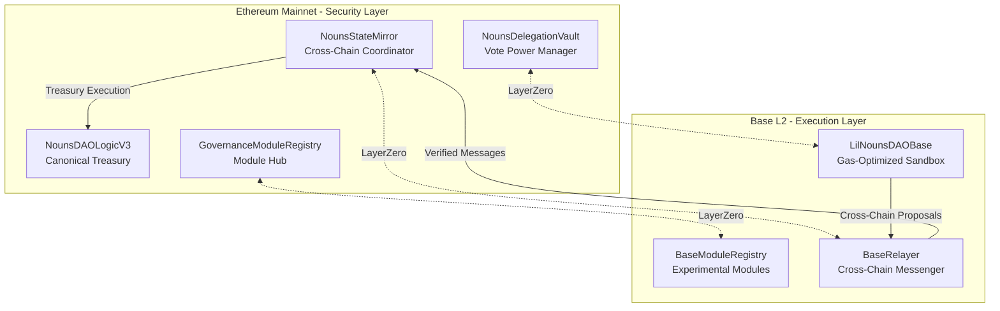

# **Nouns DAO Evolution: Phase 2 - Cross-Chain Governance & Composable Ecosystem**

## **Executive Summary: Scaling Governance Across the Multi-Chain Future**

Building upon the secure bimodal based Nouns Dao Geovernance DAO strategy established in Phase 1, Phase 2 transforms Nouns DAO into a truly cross-chain governance protocol while maintaining absolute security for the canonical Ethereum treasury. This phase leverages LayerZero's cross-chain messaging to extend governance operations to Base, creating a low-cost experimentation environment while preserving Ethereum as the ultimate source of truth.

### **Strategic Vision: Internet-Scale Governance**

**Business Rationale:** 
- Reduce governance participation costs by 90%+ through Base integration
- Enable real-time cross-chain governance operations without security compromises
- Position Nouns as the leading multi-chain DAO protocol
- Create new revenue streams through cross-chain governance services

**Technical Innovation:**
- Trust-minimized cross-chain state synchronization using LayerZero
- Composable governance modules with cross-chain execution
- Advanced delegation mechanisms with cross-chain voting power

---

## **Phase 2 Architecture: Cross-Chain Governance Engine**

### **Core System Overview**

The Phase 2 architecture extends the bimodal system to a multi-chain environment while maintaining Ethereum's canonical role:



### **2.1 Cross-Chain State Synchronization**

#### **CrossChainStateMirror (Ethereum Mainnet)**
*Enhanced from Phase 1 with cross-chain capabilities*

```solidity
// SPDX-License-Identifier: MIT
pragma solidity ^0.8.19;

import "@layerzero-contracts/interfaces/ILayerZeroEndpoint.sol";

contract CrossChainStateMirror {
    ILayerZeroEndpoint public layerZeroEndpoint;
    INounsDAOLogicV3 public nounsDAO;
    address public baseRelayer;
    uint16 public baseChainId;
    
    mapping(bytes32 => CrossChainProposal) public crossChainProposals;
    mapping(uint16 => mapping(address => bool)) public trustedRemoteLookup;
    
    struct CrossChainProposal {
        uint256 nounsProposalId;
        uint256 baseProposalId;
        bytes32 proposalHash;
        bool executed;
        uint256 baseQuorum;
    }
    
    event CrossChainProposalReceived(
        bytes32 crossChainProposalId,
        uint256 baseProposalId,
        bytes32 proposalHash,
        uint256 minQuorum
    );
    
    modifier onlyLayerZero() {
        require(msg.sender == address(layerZeroEndpoint), "Only LayerZero endpoint");
        _;
    }
    
    function lzReceive(
        uint16 _srcChainId,
        bytes calldata _srcAddress,
        uint64 _nonce,
        bytes calldata _payload
    ) external onlyLayerZero {
        require(_srcChainId == baseChainId, "Invalid source chain");
        require(trustedRemoteLookup[_srcChainId][bytesToAddress(_srcAddress)], "Untrusted remote");
        
        (bytes32 crossChainProposalId, uint256 baseProposalId, bytes32 proposalHash, uint256 minQuorum) 
            = abi.decode(_payload, (bytes32, uint256, bytes32, uint256));
        
        crossChainProposals[crossChainProposalId] = CrossChainProposal({
            nounsProposalId: 0, // To be set when created on Ethereum
            baseProposalId: baseProposalId,
            proposalHash: proposalHash,
            executed: false,
            baseQuorum: minQuorum
        });
        
        emit CrossChainProposalReceived(crossChainProposalId, baseProposalId, proposalHash, minQuorum);
    }
    
    function executeCrossChainProposal(
        bytes32 crossChainProposalId,
        uint256 nounsProposalId,
        address[] memory targets,
        uint256[] memory values,
        string[] memory signatures,
        bytes[] memory calldatas
    ) external {
        CrossChainProposal storage proposal = crossChainProposals[crossChainProposalId];
        require(!proposal.executed, "Already executed");
        
        // Verify proposal hash matches
        bytes32 calculatedHash = keccak256(abi.encode(targets, values, signatures, calldatas));
        require(proposal.proposalHash == calculatedHash, "Proposal hash mismatch");
        
        // Verify Nouns proposal passed with sufficient quorum
        (, , , uint256 forVotes, uint256 againstVotes, , bool nounsExecuted) = 
            nounsDAO.proposals(nounsProposalId);
            
        require(forVotes > againstVotes, "Nouns proposal failed");
        require(forVotes >= proposal.baseQuorum, "Insufficient quorum");
        require(!nounsExecuted, "Nouns proposal already executed");
        
        proposal.executed = true;
        proposal.nounsProposalId = nounsProposalId;
        
        nounsDAO.executeProposal(nounsProposalId);
    }
}
```

#### **BaseRelayer (Base L2)**
*Gas-optimized cross-chain messaging hub*

```solidity
// SPDX-License-Identifier: MIT
pragma solidity ^0.8.19;

import "@layerzero-contracts/interfaces/ILayerZeroEndpoint.sol";

contract BaseRelayer {
    ILayerZeroEndpoint public layerZeroEndpoint;
    address public ethereumStateMirror;
    uint16 public ethereumChainId;
    
    LilNounsDAOBase public lilNounsDAO;
    
    event CrossChainProposalSent(
        bytes32 crossChainProposalId,
        uint256 baseProposalId,
        bytes32 proposalHash
    );
    
    function submitCrossChainProposal(
        uint256 baseProposalId,
        address[] memory targets,
        uint256[] memory values,
        string[] memory signatures,
        bytes[] memory calldatas,
        uint256 minNounsQuorum
    ) external payable {
        require(msg.sender == address(lilNounsDAO), "Only LilNounsDAO");
        
        bytes32 proposalHash = keccak256(abi.encode(targets, values, signatures, calldatas));
        bytes32 crossChainProposalId = keccak256(abi.encode(baseProposalId, proposalHash, block.chainid));
        
        bytes memory payload = abi.encode(
            crossChainProposalId,
            baseProposalId,
            proposalHash,
            minNounsQuorum
        );
        
        bytes memory adapterParams = abi.encodePacked(uint16(1), uint256(200000)); // version, gas limit
        
        layerZeroEndpoint.send{value: msg.value}(
            ethereumChainId,
            abi.encodePacked(ethereumStateMirror, address(this)),
            payload,
            payable(msg.sender),
            address(0x0),
            adapterParams
        );
        
        emit CrossChainProposalSent(crossChainProposalId, baseProposalId, proposalHash);
    }
}
```

### **2.2 Advanced Cross-Chain Delegation System**

#### **CrossChainDelegationVault (Ethereum Mainnet)**
*Manages voting power across multiple chains*

```solidity
contract CrossChainDelegationVault is ERC721Holder, ERC20 {
    IERC721 public nounsToken;
    ILayerZeroEndpoint public layerZeroEndpoint;
    
    mapping(address => uint256[]) public depositedNouns;
    mapping(address => address) public crossChainDelegates;
    mapping(uint16 => mapping(address => uint256)) public crossChainVotingPower;
    
    event CrossChainDelegateUpdated(
        address delegate,
        uint16 chainId,
        uint256 votingPower
    );
    
    function depositAndDelegate(
        uint256 nounId, 
        address crossChainDelegate, 
        uint16[] memory chainIds
    ) external {
        nounsToken.safeTransferFrom(msg.sender, address(this), nounId);
        depositedNouns[msg.sender].push(nounId);
        _mint(msg.sender, 1e18);
        
        crossChainDelegates[msg.sender] = crossChainDelegate;
        
        // Distribute voting power across chains
        for (uint i = 0; i < chainIds.length; i++) {
            crossChainVotingPower[chainIds[i]][crossChainDelegate] += 1e18;
            emit CrossChainDelegateUpdated(crossChainDelegate, chainIds[i], 1e18);
        }
    }
    
    function getCrossChainVotingPower(uint16 chainId, address delegate) 
        external view returns (uint256) {
        return crossChainVotingPower[chainId][delegate];
    }
}
```

#### **BaseVotingPower (Base L2)**
*Manages delegated voting power on Base*

```solidity
contract BaseVotingPower {
    CrossChainDelegationVault public ethereumVault;
    uint16 public ethereumChainId;
    
    mapping(address => uint256) public baseVotingPower;
    
    function syncVotingPower(address delegate) external {
        // In production, this would be called via LayerZero message
        uint256 votingPower = ethereumVault.getCrossChainVotingPower(ethereumChainId, delegate);
        baseVotingPower[delegate] = votingPower;
    }
    
    function getVotingPower(address delegate) external view returns (uint256) {
        return baseVotingPower[delegate];
    }
}
```

### **2.3 Composable Governance Module Registry**

#### **CrossChainModuleRegistry (Ethereum Mainnet)**
*Curated registry with cross-chain module management*

```solidity
contract CrossChainModuleRegistry {
    struct GovernanceModule {
        address ethereumImplementation;
        address baseImplementation;
        uint256 auditScore;
        bool approved;
        bool crossChainEnabled;
        bytes32 moduleHash;
    }
    
    mapping(bytes32 => GovernanceModule) public modules;
    mapping(uint16 => mapping(bytes32 => bool)) public chainSupport;
    
    event ModuleRegistered(
        bytes32 moduleId,
        address ethereumImplementation,
        address baseImplementation,
        bool crossChainEnabled
    );
    
    function registerCrossChainModule(
        bytes32 moduleId,
        address ethereumImpl,
        address baseImpl,
        bytes memory auditReport,
        uint16[] memory supportedChains
    ) external onlyLilNouns {
        bytes32 moduleHash = keccak256(abi.encode(ethereumImpl, baseImpl, auditReport));
        
        modules[moduleId] = GovernanceModule({
            ethereumImplementation: ethereumImpl,
            baseImplementation: baseImpl,
            auditScore: calculateAuditScore(auditReport),
            approved: false,
            crossChainEnabled: true,
            moduleHash: moduleHash
        });
        
        for (uint i = 0; i < supportedChains.length; i++) {
            chainSupport[supportedChains[i]][moduleId] = true;
        }
        
        emit ModuleRegistered(moduleId, ethereumImpl, baseImpl, true);
    }
    
    function executeWithModule(
        bytes32 moduleId,
        bytes memory params,
        uint16 executionChain
    ) external view returns (address module, bytes memory executeData) {
        GovernanceModule storage module = modules[moduleId];
        require(module.approved, "Module not approved");
        require(chainSupport[executionChain][moduleId], "Chain not supported");
        
        if (executionChain == 1) { // Ethereum
            return (module.ethereumImplementation, params);
        } else if (executionChain == 8453) { // Base
            return (module.baseImplementation, params);
        }
    }
}
```

### **2.4 Gas-Optimized LilNouns on Base**

#### **LilNounsDAOBase (Base L2)**
*Low-cost governance experimentation environment*

```solidity
contract LilNounsDAOBase {
    BaseRelayer public relayer;
    BaseVotingPower public votingPower;
    CrossChainModuleRegistry public moduleRegistry;
    
    mapping(uint256 => Proposal) public proposals;
    mapping(bytes32 => bool) public executedProposals;
    
    struct Proposal {
        address proposer;
        address[] targets;
        uint256[] values;
        string[] signatures;
        bytes[] calldatas;
        uint256 startBlock;
        uint256 endBlock;
        uint256 forVotes;
        uint256 againstVotes;
        bool executed;
        bytes32 crossChainId;
    }
    
    function proposeWithModule(
        bytes32 moduleId,
        bytes memory moduleParams,
        address[] memory targets,
        uint256[] memory values,
        string[] memory signatures,
        bytes[] memory calldatas,
        string memory description,
        uint256 minNounsQuorum
    ) external returns (uint256) {
        // Execute module-specific validation
        (address module, bytes memory executeData) = 
            moduleRegistry.executeWithModule(moduleId, moduleParams, 8453); // Base chain ID
        
        // Perform module pre-execution logic
        (bool success, ) = module.delegatecall(executeData);
        require(success, "Module pre-execution failed");
        
        // Create proposal
        uint256 proposalId = _createProposal(targets, values, signatures, calldatas, description);
        
        // Submit to cross-chain relayer
        relayer.submitCrossChainProposal{value: msg.value}(
            proposalId,
            targets,
            values,
            signatures,
            calldatas,
            minNounsQuorum
        );
        
        return proposalId;
    }
    
    function castVote(uint256 proposalId, uint8 support) external {
        require(proposals[proposalId].endBlock > block.number, "Voting ended");
        
        uint256 voterPower = votingPower.getVotingPower(msg.sender);
        require(voterPower > 0, "No voting power");
        
        if (support == 1) {
            proposals[proposalId].forVotes += voterPower;
        } else {
            proposals[proposalId].againstVotes += voterPower;
        }
    }
}
```

---

## **Phase 2 Implementation Timeline**

### **Quarter 1: Cross-Chain Foundation**
- Deploy LayerZero-integrated StateMirror on Ethereum
- Deploy BaseRelayer and LilNounsDAOBase on Base
- Implement cross-chain messaging security model

### **Quarter 2: Delegation & Voting**
- Deploy CrossChainDelegationVault on Ethereum
- Implement BaseVotingPower synchronization
- Launch gasless voting on Base with Snapshot integration

### **Quarter 3: Module Ecosystem**
- Deploy CrossChainModuleRegistry
- Develop first-party governance modules
- Launch module developer grant program

### **Quarter 4: Optimization & Scaling**
- Performance optimization and gas cost reduction
- Additional L2 chain integrations (Arbitrum, Optimism)
- Advanced cross-chain governance analytics

---

## **Success Metrics & KPIs**

### **Technical Metrics**
- Cross-chain message delivery: >99.9% reliability
- Message finality: <2 minutes Ethereum to Base
- Gas cost reduction: >90% vs Ethereum-only operations
- Module execution success rate: >99.5%

### **Business Metrics**
- Base participation rate: >40% of total governance activity
- Delegation participation: >60% of total Nouns
- Module ecosystem: >20 community-developed modules
- Cross-chain proposal success rate: >80%

### **Security Metrics**
- Zero critical vulnerabilities in cross-chain bridges
- 100% successful guardian interventions (if needed)
- Timelock adherence: 100%

---

## **Risk Mitigation**

### **Cross-Chain Security**
- **Circuit Breakers:** Automatic pause mechanisms for anomalous message patterns
- **Quorum Guards:** Minimum participation requirements for cross-chain execution
- **Multi-Sig Guardians:** Emergency intervention capabilities for bridge issues

### **Economic Security**
- **Cost Controls:** Maximum gas limits and cost caps per operation
- **Slashing Conditions:** Penalties for malicious module behavior
- **Insurance Fund:** Treasury allocation for cross-chain incident coverage

### **Governance Security**
- **Vote Power Limits:** Maximum delegation concentration limits
- **Time Delays:** Critical operation timelocks maintained
- **Module Sandboxing:** Isolated execution environments for experimental modules

---

## **Conclusion: The Multi-Chain DAO Standard**

Phase 2 establishes Nouns DAO as the pioneering multi-chain governance protocol, demonstrating that treasury security and governance scalability are not mutually exclusive. By leveraging Ethereum for canonical security and Base for operational efficiency, we create a template for internet-scale decentralized organizations.

This architecture provides:
- **For Token Holders:** Reduced participation costs while maintaining treasury security
- **For Developers:** Rich ecosystem for governance innovation
- **For the Ecosystem:** Proven framework for multi-chain DAO operations
- **For Investors:** Enhanced protocol value through ecosystem expansion

The Phase 2 implementation positions Nouns DAO to become the standard for sophisticated, secure, and scalable on-chain governance across the entire blockchain ecosystem.

**Ready for execution upon Phase 1 completion and successful security audit.**
